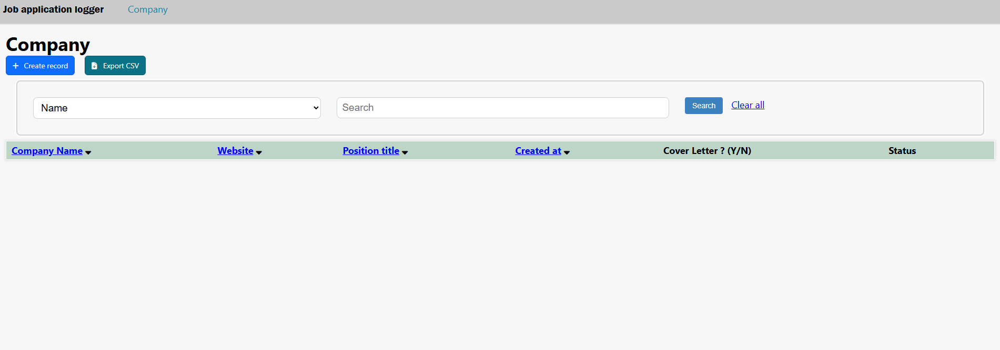
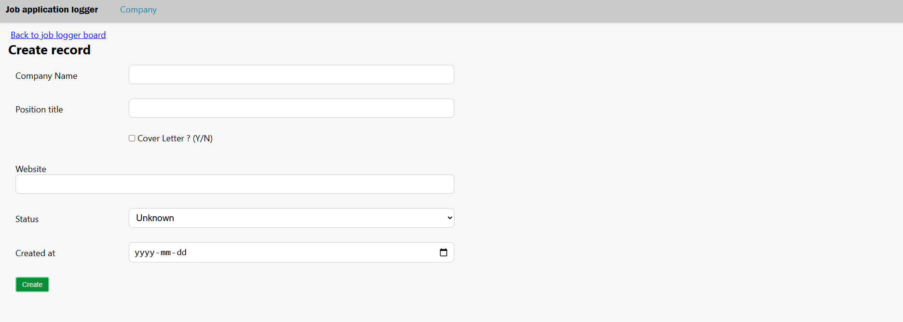
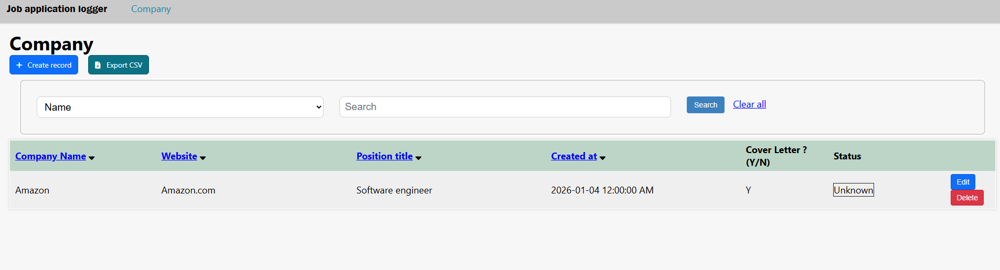
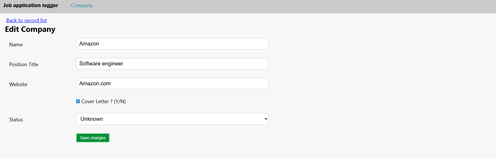
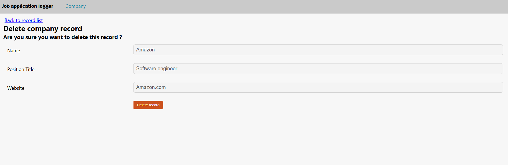

# JobApplicationLogger

JobApplicationLogger is a lightweight ASP.NET Core web application for tracking job applications by company. It provides CRUD (create/read/update/delete) operations, filtering, sorting, validation, and CSV export. The app uses Entity Framework Core for persistence and a service layer to encapsulate business logic.

## Short description
A simple, production-ready starter to record companies and related job application metadata (position, cover letter, status, created date) with a web UI (Controllers + Views), CSV export and unit tests.

## Tech stack
- .NET 8 (C# 12)
- ASP.NET Core (Controllers + Views)
- Entity Framework Core 8 (SQL Server provider)
- CsvHelper (CSV output) and EPPlus (Excel support)
- Projects:
  - JobApplicationLogger — Web UI
  - Entities — EF Core models and DbContext
  - ServiceContracts — DTOs and interfaces
  - Services — Business logic, CSV helpers
  - CRUDTests — xUnit unit tests

## Features
- Add / Edit / Delete company records
- Search and filter (multiple fields)
- Sort results (ascending/descending)
- CSV export endpoint
- Data validation via DataAnnotations
- Unit tests for service layer

## Quick start

1. Prerequisites
   - .NET 8 SDK
   - SQL Server or LocalDB
   - Recommended: Visual Studio 2022 (latest updates) or VS Code

2. Configure connection string
   Edit JobApplicationLogger/appsettings.json and set `DefaultConnection`:

   {
     "ConnectionStrings": {
       "DefaultConnection": "Server=(localdb)\\mssqllocaldb;Database=JobApplicationLoggerDb;Trusted_Connection=True;"
     }
   }

3. Apply EF Core migrations
   - CLI:
     dotnet ef migrations add InitialCreate --project Entities --startup-project JobApplicationLogger --context companyDbContext
     dotnet ef database update --project Entities --startup-project JobApplicationLogger --context companyDbContext

   - Visual Studio (__Package Manager Console__):
     - Set `Default project` to `Entities`
     - Add-Migration InitialCreate -Context companyDbContext -StartupProject JobApplicationLogger
     - Update-Database -Context companyDbContext -StartupProject JobApplicationLogger

4. Run the app
   - Visual Studio: open the solution, set `JobApplicationLogger` as startup project and use __Start Debugging__ (F5) or __Start Without Debugging__ (Ctrl+F5).
   - CLI:
     cd JobApplicationLogger
     dotnet run

   The app runs at http://localhost:{port} (port printed to console).

5. Run tests
   - CLI: dotnet test ./CRUDTests
   - Visual Studio: open __Test Explorer__ and run tests.

## Important endpoints / routes
- GET / or /Company/Index — list companies (search & sort)
- GET /Company/Add — new company page
- POST /Company/Add — create
- GET /Company/Edit/{companyId} — edit page
- POST /Company/Edit/{companyId} — update
- GET /Company/Delete/{companyId} — delete confirmation
- POST /Company/Delete/{companyId} — delete
- GET /Company/CompanyCSV — downloads companies.csv

CSV route returns a MemoryStream from the service and is served via:
return File(memoryStream, "application/octet-stream", "companies.csv");

## Project layout (high level)
- JobApplicationLogger
  - Controllers — CompanyController
  - Views — Company views and shared partials
  - wwwroot — static assets (CSS)
  - Program.cs — DI and DbContext registration
- Entities
  - companyDbContext, Company model, CompanyApplicationStatus enum
- ServiceContracts
  - DTOs (CompanyAddRequest, CompanyUpdateRequest, CompanyResponse)
  - ICompanyService
- Services
  - CompanyService (implements ICompanyService)
- CRUDTests
  - xUnit tests for service behavior

## Development notes & tips
- DTO validation uses DataAnnotations; controllers check ModelState and pass errors to views via ViewBag.Errors.
- Sorting and filtering are implemented in the service layer — keep UI thin.
- If using EPPlus for Excel exports, verify licensing requirements for non-development use.

## Screenshots

*Company list with search and CSV export.*

*Add new company form.*

*Added company record.*

*Edit company record.*

*Delete company record.*

